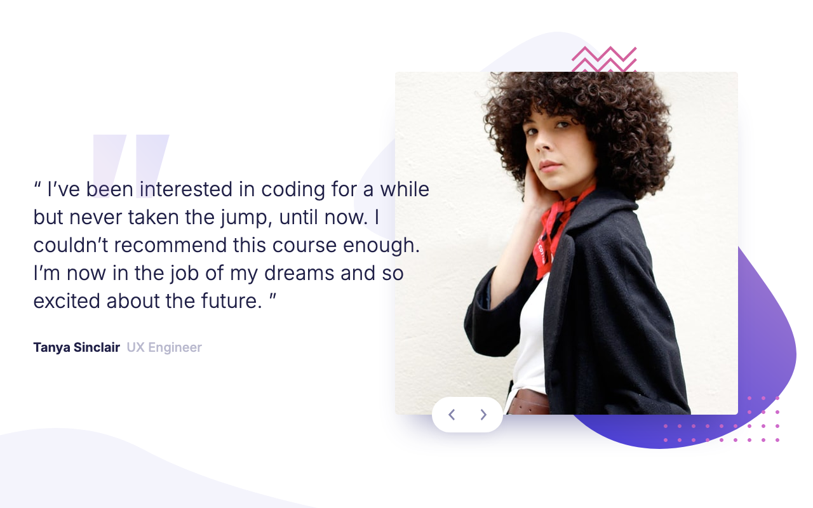

# Coding bootcamp testimonials slider

This is a solution to the [Coding bootcamp testimonials slider challenge on Frontend Mentor](https://www.frontendmentor.io/challenges/coding-bootcamp-testimonials-slider-4FNyLA8JL). Frontend Mentor challenges help you improve your coding skills by building realistic projects.

## About the Project

_This challenge was created during my learning phase with React_, it focuses on creating an engaging user interface where users can browse through different testimonials by clicking through them. The use of React allows for state management of the slider, while Scss helps in maintaining a clean and organized style structure, enhancing the visual appeal and responsiveness of the testimonials.

## Preview and Links

| View it live: | [Live Demo URL](https://ionstici.github.io/coding-bootcamp-testimonials-slider) | [Frontend Mentor](https://www.frontendmentor.io/solutions/coding-bootcamp-testimonials-6byETIfcCM) |
| ------------- | ------------------------------------------------------------------------------- | -------------------------------------------------------------------------------------------------- |

<b>Open Preview</b>

 

## Features

-   **Testimonials Slider:** Users can navigate through different testimonials using a slider, with smooth transitions.
-   **Responsive Design:** Designed to look great on all devices, from mobile to desktop, using CSS and Scss.
-   **Interactive Navigation:** Includes navigation arrows for easy switching between testimonials.

## Tech Stack

-   **React:** Using `create-react-app` for setting up the project, enabling component-based architecture.
-   **CSS3:** For foundational styling.
-   **Scss:** For advanced styling, providing variables, mixins, and nested rules to streamline CSS.
